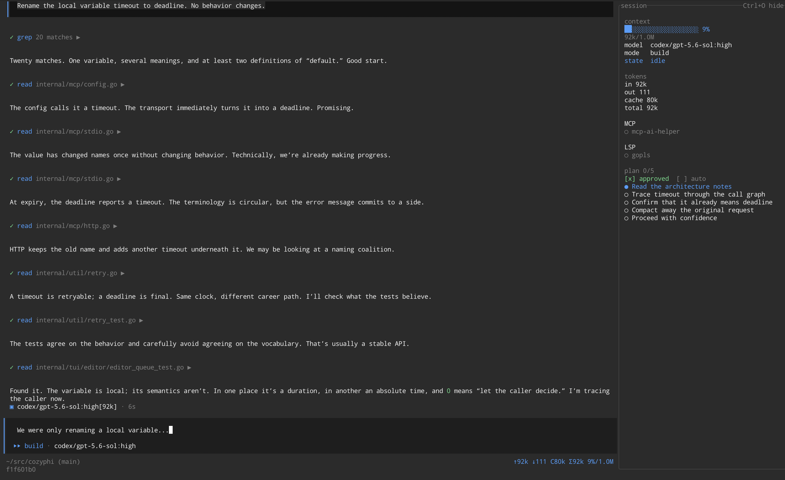

# CozyPhi

A comfortable, feature-rich terminal coding agent written in Go.

[](https://github.com/alvnukov/cozyphi/actions/workflows/ci.yml)
[](https://github.com/alvnukov/cozyphi/releases/latest)
[](https://github.com/alvnukov/cozyphi/actions/workflows/ci.yml)
[](https://goreportcard.com/report/github.com/alvnukov/cozyphi)



## Highlights

- Interactive terminal UI with streaming output, session history, and resume support.
- Permission gates and approval-aware plans keep tool execution under user control.
- Built-in file, search, shell, LSP, question, and sub-agent tools.
- MCP integrations without loading every remote tool schema into the model context.
- Project and user hooks for customizing the agent workflow.
- Per-project agent memory: what the agent learns about you rides in every prompt, what it learns about the work is retrieved for the turn that needs it, and what stops earning its place is compacted or forgotten — reversibly.
- Background watches: the agent starts a log tail, a poll, or a timer and is woken when something happens, instead of burning turns on polling — capped, gated, and stoppable.
- Headless mode with JSONL output for scripts and CI.

## Install

### macOS and Linux

```sh
curl -fsSL https://raw.githubusercontent.com/alvnukov/cozyphi/main/scripts/install.sh | bash
```

### Windows

```powershell
irm https://raw.githubusercontent.com/alvnukov/cozyphi/main/scripts/install.ps1 | iex
```

Release binaries are also available on the [GitHub Releases](https://github.com/alvnukov/cozyphi/releases) page.

## Quick start

Start the TUI in your project directory — a fresh install needs no
configuration first: the first start writes a commented `~/.cozyphi/config.yaml`
and opens with a notice explaining how to connect a model.

```sh
cozyphi
```

Pick a model in one of three ways:

- `/connect` in the TUI signs in to a provider, then `/model` picks a model.
- `cozyphi config` edits `~/.cozyphi/config.yaml`; add a `models:` entry.
- `COZYPHI_MODEL` and `COZYPHI_API_KEY` configure a model without a file.

Without a configured model the TUI still starts: a connected provider (or an
opencode install) is picked automatically and named in a startup notice, and a
prompt submitted with no model at all is refused with the same hint instead of
starting a turn. The headless `cozyphi run` requires a resolvable model and
exits with these three options when none is.

The TUI remembers the last model you used and starts the next fresh session
with it (an explicit `COZYPHI_MODEL` still wins); switch any time with `/model`.

Useful commands:

```text
cozyphi -c                   resume the newest session for this directory
cozyphi --resume ID          resume a session by id or unique prefix
cozyphi run -p "..."         run one agent loop headlessly
cozyphi sessions list        list sessions for this directory
cozyphi memory               show what the agent remembers here
cozyphi mcp --help           manage MCP servers
cozyphi update               install the latest release
```

Run `cozyphi --help` or `cozyphi <command> --help` for the full command reference.

## Documentation

- [Hooks](doc/hooks.md)
- [MCP](doc/mcp.md)
- [OpenCode integration](doc/opencode.md)
- [Terminal UI](doc/tui.md)
- [Watches](doc/watch.md)
- [Project layout](doc/project-layout.md)
- [Contributing](CONTRIBUTING.md)

## Build from source

CozyPhi requires Go 1.26.3 or newer.

```sh
git clone https://github.com/alvnukov/cozyphi.git
cd cozyphi
make build
```

Before submitting a change, run:

```sh
make fmt-check lint test
```

## License

[MIT](LICENSE)
