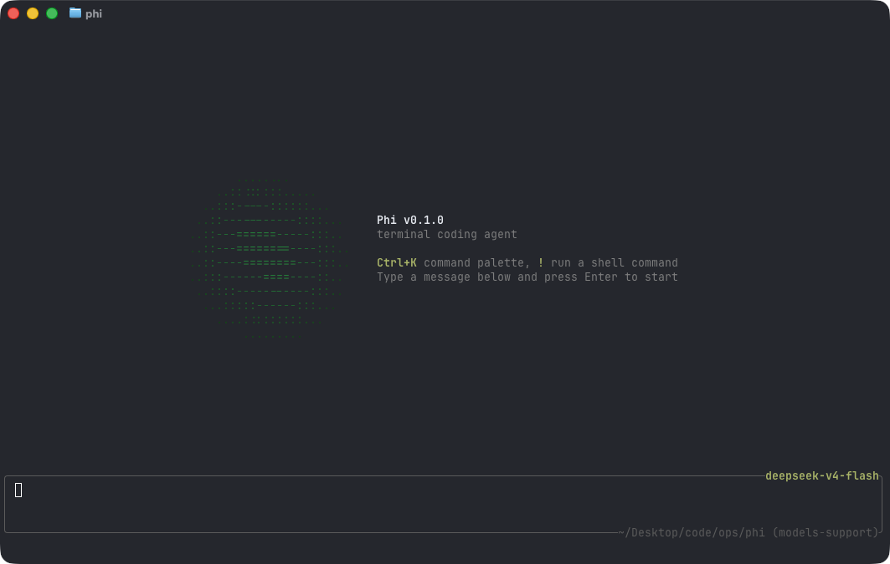
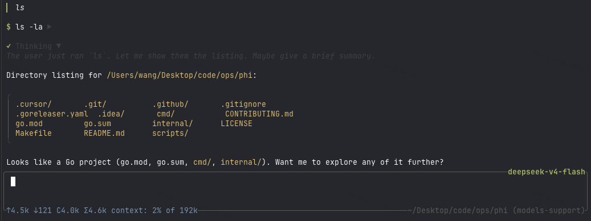

# phi

A minimal terminal coding agent harness, written in Go. Talk to a model, let it
read, edit, and run commands in your repository, and pick up where you left off
with per-directory persisted sessions.





phi is deliberately small: a model loop, a handful of tools, a TUI, and
Markdown rendering that makes assistant output readable. Extend it with
[skills](#skills) and configure it with a single YAML file.

- [Quick start](#quick-start)
- [Footprint](#footprint)
- [Configuration](#configuration)
- [Interactive mode](#interactive-mode)
- [Commands](#commands)
- [Sessions](#sessions)
- [Headless mode](#headless-mode)
- [Skills](#skills)
- [Permissions](#permissions)
- [Tools](#tools)
- [Project layout](#project-layout)

## Quick start

Install the latest release (macOS / Linux):

```sh
curl -fsSL https://raw.githubusercontent.com/pulseaiclub/phi/main/scripts/install.sh | bash
```

First launch needs a model. Open the config editor (creates `~/.phi` layout
and writes `~/.phi/config.yaml`):

```sh
phi config
```

Or set env vars for a one-off run:

```sh
export PHI_MODEL=gpt-4o
export PHI_API_KEY=sk-...
```

Then start the TUI:

```sh
phi
```

Or build from source (Go 1.26.3+, see `go.mod`):

```sh
make build          # produces ./phi
make install        # build and install into $GOBIN
```

On first start, phi automatically creates `~/.phi/{bin,skills,session}`. Search
tools (`fd`, `rg`) download into `~/.phi/bin` in the background when missing.

The TUI gives the model four core tools — `read`, `write`, `edit`, and
`bash` — plus `grep`, `glob`, `list`, and `fetch`. The model uses these to
fulfill your requests.

## Footprint

phi aims to stay cheap to run and cheap to hack on. Numbers below are for a
stripped release build (`CGO_ENABLED=0`, `-ldflags="-s -w"`), measured on
macOS arm64 unless noted.

| Metric | phi |
| --- | ---: |
| Release binary | **~12 MB** |
| Idle RSS (1 session) | **~21 MB** |
| 10 idle sessions (total RSS) | **~196 MB** (~20 MB each) |
| Time to first frame | **~40 ms** (27–65 ms) |
| Cold `go build` (empty `GOCACHE`) | **~5.5 s** |
| Warm rebuild | **~0.7 s** |
| Go source (excl. tests) | **~22k LOC** / 107 files |
| Go packages | **32** |
| Direct module deps | **6** (15 modules total) |
| Linked runtimes | system libs only (no Node / Electron / Python) |

## Configuration

phi reads `~/.phi/config.yaml` (standard YAML). Environment variables
override it for one-off runs. `phi config` opens an HTML editor for the same
file in your browser.

```yaml
# ~/.phi/config.yaml
models:
  - name: gpt-4o            # model name; "claude-*" routes to the Anthropic API
    api_key: sk-...         # or set PHI_API_KEY
    base_url: https://api.openai.com/v1   # default; PHI_BASE_URL overrides
    context_window: 128000  # optional
    default: true           # the model used at startup; first entry wins if absent
  - name: claude-sonnet-4-20250514   # extra models; switchable at runtime
    api_key: sk-ant-...
    base_url: https://api.anthropic.com
    context_window: 200000

skill_path: ~/.phi/skills # where SKILL.md files are loaded from

permissions:
  mode: interactive       # interactive | readonly | autopilot | headless-strict
  bash:
    default: ask          # ask | allow | deny
    allow:
      - "go test ./..."
    deny:
      - "rm -rf *"
  fetch:
    default: allow
    allowed_hosts:
      - "github.com"
```

Environment overrides:

| Variable         | Overrides          |
| ---------------- | ------------------ |
| `PHI_API_KEY`    | `models[].api_key` (default model) |
| `PHI_MODEL`      | `models[].name` (default model) |
| `PHI_BASE_URL`   | `models[].base_url` (default model) |
| `PHI_SKILL_PATH` | `skill_path`       |

Provider routing: a base URL containing `anthropic` or a model name starting
with `claude` uses the Anthropic Messages API; everything else uses the
OpenAI-compatible `/chat/completions` path.

### Workspace layout

```
~/.phi/
├── config.yaml   # global configuration
├── bin/          # downloaded search tools (fd, ripgrep)
├── skills/       # SKILL.md skill directories
└── session/      # persisted sessions, one dir per working directory
    └── <encoded-cwd>/
```

## Interactive mode

`phi` (or `phi tui`) starts the TUI: a chat transcript on top, an editor at
the bottom, and a footer with the current activity. When a newer release is
available, the footer shows a hint like `0.2.0 available · phi update`.

Assistant output is rendered as Markdown (CommonMark/GFM): headings, emphasis,
strikethrough, links, blockquotes, lists, task checkboxes, and tables are
styled with the active theme; fenced code blocks get a frame and per-language
syntax highlighting. Structural markers (`#`, `` ` ``, `*`) are stripped.

The editor supports:

- `@` — fuzzy file mention picker (type `@` and start typing a path)
- `/` — slash command picker (`/sessions`, `/resume`)
- `!command` — run a shell command locally and stream its output into the
  transcript (see [Commands](#commands))
- `Ctrl+K` — command palette: settings → model / theme / permissions, skills

### Keyboard shortcuts

| Key            | Action                          |
| -------------- | ------------------------------- |
| `Ctrl+C`       | Quit phi                        |
| `Esc`          | Cancel the running agent / close pickers |
| `Ctrl+K`       | Toggle the command palette      |
| `Ctrl+Shift+C` | Copy the selected transcript text |

Themes: `Dark`, `Darcula`, `Pink`, and `Terminal` (default), switchable from
the palette under settings → theme.

## Commands

| Command            | Description                                   |
| ------------------ | --------------------------------------------- |
| `phi` / `phi tui`  | Start the interactive TUI                     |
| `phi run -p "…"`   | Run one agent loop headlessly (see below)     |
| `phi update`       | Download and install the latest GitHub release |
| `phi update --check` | Query the latest release without installing |
| `phi sessions list`| List persisted sessions for this directory    |
| `/sessions`        | List sessions for this directory (TUI)        |
| `/resume <id>`     | Resume a session by id or unique prefix (TUI) |
| `!command`         | Run a shell command locally, stream output into the transcript; `Esc` cancels it |

In the TUI, `!command` runs locally via `bash -c` — outside the agent loop. It
doesn't count toward agent busy state, and the running command can be cancelled
with `Esc` without touching an in-flight agent turn.

## Sessions

Sessions persist automatically per working directory under
`~/.phi/session/<encoded-cwd>/` as JSONL trajectories.

- `phi sessions list` — list session id, mtime, and preview for the current
  directory
- `/sessions` in the TUI — same, in-app
- `/resume <id>` — continue a session (id or unique prefix)
- `phi run --session <id>` / `phi run --continue-last` — resume headlessly

## Headless mode

```sh
phi run -p "fix the failing test in internal/tools"
```

Runs one agent loop without a TUI. Human logs go to stderr; with `--jsonl`,
machine-readable events go to stdout, one JSON object per line (schema in
`../ops/phi-docs/docs/task-003-jsonl-events.md`).

Flags:

| Flag                 | Description                                    |
| -------------------- | ---------------------------------------------- |
| `-p, --prompt STRING`| Prompt to run (required)                       |
| `--jsonl`            | Emit JSONL events to stdout                    |
| `--max-rounds N`     | Cap tool rounds (default 64)                   |
| `--session ID`       | Resume a persisted session by id or unique prefix |
| `--continue-last`    | Resume the newest persisted session for this directory |
| `--session-dir DIR`  | Override the session storage directory         |

Exit codes: `0` success · `1` runtime/LLM error · `2` max rounds reached ·
`3` config/usage error.

In headless mode, permission `ask` decisions are denied (there is no approval
UI), so `readonly`-style safety applies without extra flags.

## Skills

Skills are directories containing a `SKILL.md` file with YAML frontmatter and
a Markdown body. They are loaded from `~/.phi/skills/` (or `skill_path` /
`PHI_SKILL_PATH`) and injected into the agent's context, letting you give the
model reusable procedures:

```markdown
---
name: My Skill
 description: What this skill does
license: MIT
compatibility: claude, openai
---
Instructions the agent should follow when this skill is relevant.
```

In the TUI, add skills from the palette (skills → list), then submit the
message with the selected skills applied.

## Permissions

Tool execution is gated by a permission policy, so the agent can run read-only
by default and ask before anything destructive. Configure it under
`permissions:` in `~/.phi/config.yaml`.

Modes:

| Mode               | Behavior                                            |
| ------------------ | --------------------------------------------------- |
| `interactive`      | Default. `ask` decisions prompt in the TUI.         |
| `readonly`         | Deny writes / bash; read tools still work.          |
| `autopilot`        | Fold `ask` → allow, run unattended.                 |
| `headless-strict`  | Fold `ask` → deny (used by `phi run`).              |

Per-tool rules: `bash.default` / `bash.allow` / `bash.deny` (exact command
prefix matching) and `fetch.default` / `fetch.allowed_hosts`. Global keys:
`workspace_only_writes` (default true), `ask_timeout_sec`, and
`dangerously_allow_all` (default false).

In the TUI, an approval dialog replaces the editor with options to approve,
deny with feedback, or allow all for the session / for every session. The
palette's settings → permissions entry toggles session-wide bypass.

## Tools

Built-in tools the model can call (see `internal/tools/`):

| Tool    | Purpose                                  |
| ------- | ---------------------------------------- |
| `bash`  | Run a shell command in the working directory |
| `read`  | Read a file                              |
| `write` | Write a file (gated by permissions)      |
| `edit`  | Targeted edit of a file                  |
| `grep`  | Regex search across files                |
| `glob`  | File patterns                            |
| `list`  | Directory listing                        |
| `fetch` | HTTP fetch (host-gated by permissions)   |

Fast search tools (`fd`, `ripgrep`) are downloaded on first startup into
`~/.phi/bin` when missing.

## Project layout

| Path                     | Purpose                                        |
| ------------------------ | ---------------------------------------------- |
| `cmd/`                   | Entry points (`main.go`, `phi run`, `phi update`, `phi sessions`) |
| `internal/util/update/` | Self-update check + GitHub Releases install |
| `internal/agent/`        | Agent engine, executor, prompts                |
| `internal/components/`   | TUI widgets (chat, input, palette, mention, …) |
| `internal/llm/`          | LLM clients (OpenAI-compatible + Anthropic), streaming, skills |
| `internal/project/`      | Workspace layout and config                    |
| `internal/session/`      | Session persistence, load/apply                |
| `internal/tools/`        | Agent tools (bash, read, edit, grep, glob, …)  |
| `internal/toolmanager/`  | External tool discovery/download               |
| `internal/tui/`          | Terminal UI wiring: controller, commands, keymaps |
| `internal/util/`         | Shared helpers (diff, retry, SSE, file search, …) |
| `internal/permission/`   | Permission policy and ask gate                 |

See [CONTRIBUTING.md](CONTRIBUTING.md) for development setup, code style, and
commit conventions. Design docs and the harness roadmap live in
`../ops/phi-docs/`.
