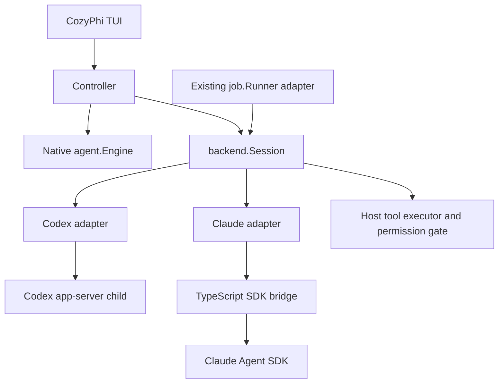

# External agent backends

Status: proposed design, 2026-09-05. This document authorizes no runtime switch
or relaxation of existing invariants. Implementation is a separate task.
Vocabulary: [CONTEXT.md](../CONTEXT.md).

## Outcome and scope

Give CozyPhi one interface for an external agent session, with Codex app-server
and Claude Agent SDK adapters. The interface owns process lifetime, protocol
translation, turn correlation, interaction delivery, and recovery semantics.
Callers use typed operations and events, never provider JSON or shell strings.

The primary proposed consumer is the TUI. An adapter for the existing
`job.Runner` can later use the same session module for delegation. These are
different consumers: a user conversation exposes a transcript; a delegated
job returns the existing bounded wait/task summary. Do not add a second job
registry or a parallel family of model-facing tools.

This scope assumes "one tool" means one integration module, not one giant
`action` dispatcher replacing the existing agent tools. A model-facing
delegation facade, if requested, is described below without making it a
prerequisite for the TUI.

## Evidence and limits

Observed locally: `codex --version` reports 0.145.0; `claude --version` reports
2.1.261. These are CLI versions, not the version of the desktop app. The
generated Codex JSON schema was inspected without starting a conversation.
Claude SDK execution and a complete approval round trip have not been tested.

Codex documents JSON-RPC over stdio, explicit thread/turn operations, server
requests and streamed notifications. `dynamicTools` is experimental. The local
thread-start schema has `dynamicTools`, `config` and policy fields, but no
top-level `tools` allowlist. That does not prove built-in tools can be disabled.
[Codex app-server](https://learn.chatgpt.com/docs/app-server).

Claude documents persistent streaming input, interruption, explicit session
resumption/forking and custom tools through the Agent SDK. Streaming input is
not evidence of Codex-equivalent mid-turn steering. `canUseTool` only receives
calls not already approved; a universal policy check needs a `PreToolUse` hook.
[Streaming](https://code.claude.com/docs/en/agent-sdk/streaming-vs-single-mode),
[sessions](https://code.claude.com/docs/en/agent-sdk/sessions),
[permissions](https://code.claude.com/docs/en/agent-sdk/permissions),
[human input](https://code.claude.com/docs/en/agent-sdk/user-input).

Authentication and billing are not interchangeable with an API key. Anthropic's
June 15 update pauses the announced separate SDK credit and says SDK/headless
use continues against subscription limits. Product integration language in the
SDK overview remains different; distribution terms require clarification.
This design neither extracts OAuth credentials nor assumes a billing plan.
[Current subscription notice](https://support.claude.com/en/articles/15036540-use-the-claude-agent-sdk-with-your-claude-plan),
[SDK overview](https://code.claude.com/docs/en/agent-sdk/overview).

## Seam and assembly

`internal/llm` remains the inference interface for CozyPhi's own engine. An
external agent is not an `llm.Client`: nesting its complete tool loop inside
the current engine would create two owners of execution and context.

Proposed package layout:

- `internal/backend`: common session interface, typed events and lifecycle.
- `internal/backend/codex`: app-server protocol and process adapter.
- `internal/backend/claude`: Go adapter for the SDK bridge.
- `bridge/claude`: a small TypeScript program using the official Agent SDK.

Codex runs as a dedicated child process over stdio. Claude runs through the
TypeScript bridge over framed JSON lines on stdio, using the SDK's persistent
input mode. The bridge contains protocol conversion and callbacks, not policy,
session storage, or a second job scheduler. Node and the SDK are explicit
optional dependencies of the Claude adapter, pinned and installed outside a
turn; there is no silent download at session start.

`cmd` supplies the executable paths, workspace, event store and host tool
executor through explicit constructor parameters. Configuration structs describe
values, not dependency bags. Transport details stay inside each adapter.

The current `controller.Controller` stores a concrete `*agent.Engine` and
assembles it in `newEngine`; this is not a drop-in replacement today. Extract
the user-turn operations at that seam only after both adapters pass their
contract tests. Keep native-only plan, watch and memory operations explicitly
capability-gated. `components` stay dumb and `controller.Bus` remains the UI
delivery path. Do not add backend switches throughout widgets.



## Common interface

The following is a design sketch, not a compilable API declaration. Named
request/result types are value types with explicit validation and no `any`
or `map[string]any` escape hatch for provider options.

```go
type Backend interface {
    Inspect(context.Context) (Availability, error)
    Open(context.Context, OpenRequest) (Session, error)
}

type Session interface {
    Snapshot() Snapshot
    Events() <-chan Event
    Submit(context.Context, SubmitRequest) (Receipt, error)
    Steer(context.Context, SteerRequest) (Receipt, error)
    Respond(context.Context, InteractionResponse) error
    Interrupt(context.Context, TurnID) error
    Close(context.Context) error
}
```

`Inspect` reports installed runtime/bridge versions, authentication state and
available capabilities. Model discovery is account-scoped metadata, with its
source and freshness; absence is unknown, not an empty account or zero quota.
`OpenRequest` contains backend identity, canonical workspace, new-or-explicit-
resume identity, model selection, approved context and the host-tool profile.
The context passed to `Open` owns the session lifetime; its caller keeps it
alive until the session closes. Failed construction cleans up all children.

`SubmitRequest` has a caller operation ID and typed text/image input. It is
accepted only while idle; otherwise it returns `busy`. A successful receipt
means accepted, not completed. `SteerRequest` includes the expected active
TurnID; it returns `unsupported` when exact in-flight semantics are unavailable.
Queued input is a separate controller feature and is never silently called
steering. Model/effort changes apply to a subsequent turn only.

`Respond` is a human-controller operation for a live interaction ID, never an
operation exposed to the parent model. It accepts a typed decision or typed
answers, not a permission mode or arbitrary backend request. `Interrupt` waits
for a terminal turn outcome or returns an explicit uncertain/timeout error;
an acknowledgement of receipt alone is insufficient. `Close` is idempotent and
stops the whole owned process tree under a bounded shutdown budget.

Per-method contexts bound acknowledgement waits. Losing such a wait after
sending a mutation produces `outcome_unknown`; it does not imply the server
ignored the request. No automatic replay of submit, tool execution or answers.
Use snapshot/reconciliation or explicitly resume; prevent duplicate submissions
within one process with the operation ID. Do not promise cross-crash exactly-
once execution when the backend supplies no idempotency contract.

Errors are typed: `unavailable`, `auth_required`, `unsupported`, `busy`,
`stale_turn`, `stale_interaction`, `policy_denied`, `protocol_error`,
`outcome_unknown`. Backend diagnostics are redacted, bounded details.

## Events, interactions and state

Use a closed set of typed payloads: session ready, turn started, text delta,
tool activity, interaction requested/resolved, usage, warning, turn finished,
session closed. Go implementations can use a sealed payload interface; callers
must not inspect untyped backend maps. Each envelope carries session ID,
generation, monotonically increasing sequence, optional turn/item IDs and time.
Reasoning events contain only summaries/content actually exposed by the SDK;
opaque reasoning artifacts stay backend-owned.

`Interaction` distinguishes permission, question and external authentication.
It records request ID, originating tool/item, operation digest, expiry and
scope. The UI can answer multiple concurrent interactions independently. A
decision authorizes only the presented operation. Late, duplicate, mismatched
or post-cancellation answers are rejected. Closing a session denies/cancels
pending interactions and unblocks every SDK callback.

Session states: opening -> idle -> active -> idle; any state may close or
disconnect. Awaiting interactions is a set attached to an active turn, not a
single global boolean: parallel tools can wait independently. Every accepted
turn has one terminal outcome: completed, interrupted, failed or disconnected.
Process exit with a pending turn is not successful completion.

A single session actor serializes state transitions and journal writes. The
stdout decoder continues processing responses while interactions await the UI;
otherwise responding to an approval can deadlock behind its own request.
Text deltas may be coalesced. Control events, approvals and terminal outcomes
are never dropped. A bounded queue that cannot drain fails the session cleanly
instead of consuming unbounded memory. Slow TUI subscribers recover through a
snapshot/journal cursor. UI generation checks prevent an old session from
writing into a newly selected one.

## Capabilities and adapter mapping

Capabilities are explicit supported/unsupported/unverified values with reasons,
derived from the actual runtime, account and validated adapter contract. An
unknown JSON field can be ignored; an unknown server request must receive a
defined unsupported/deny response rather than hang.

| Operation | Codex adapter | Claude adapter |
| --- | --- | --- |
| Start/resume | `thread/start`, `thread/resume` | persistent SDK query with explicit `resume` |
| Start turn | `turn/start` | input queue into the SDK session |
| Stream | item/turn notifications | SDK messages and partial events |
| Interrupt | `turn/interrupt` + terminal event | SDK interruption + terminal result |
| Human input | server request IDs | `canUseTool` callback and abort signal |
| Host tools | experimental dynamic tool calls | SDK custom MCP tools |
| Steer | `turn/steer` with expected turn ID | unverified; no queue-as-steer substitution |
| Fork/compact | backend operations, optional later | SDK-specific behavior, optional later |

Session management, account status, models and quota are separate capability
groups. Do not claim matching billing fields or reset behavior between vendors.
Do not expose a backend method just because a newer online manual lists it.

## Tool ownership is the release gate

The default integration must preserve PreHooks -> Gate/Ask -> Run -> PostHooks.
CozyPhi owns host-tool execution; the external runtime supplies the agent loop.
Codex dynamic calls and Claude custom tools invoke the same trusted executor.
Editable reads and edits share a session-scoped capability ledger; switching
sessions or backends retires capabilities. Raw tool arguments never become
shell command templates.

The external runtime must be configured and verified so built-in file writes,
shell execution, direct MCP connectors, hidden tools and nested agents cannot
bypass that executor. Instruction text asking it to avoid tools is not an
enforcement mechanism. Read-only sandboxing alone is not sufficient: shell,
network tools, configured hooks and external MCP calls have other effects.

This is not yet proven for Codex 0.145.0. Its approval notifications alone
cannot establish that every tool is intercepted. Claude's `canUseTool` alone
also cannot establish it; explicit tool selection and a universal pre-hook
must be tested against auto-allow rules and all supported execution paths.
Until the proof exists, mark `hostToolIsolation` unverified and refuse to
enable an external backend in normal sessions. Protocol-only tests and an
isolated experiment can proceed without claiming production parity.

A backend-owned-tools mode would be a different contract, dropping CozyPhi's
hashline and per-tool gate invariants for those operations. It is a possible
future architectural choice requiring an explicit decision, not a fallback
when host-tool isolation fails. Never silently enable bypass/accept-edits or
weaken OS sandboxing to make an adapter work.

## Workspace, configuration and authentication

WorkDir is an explicit canonical worktree path. Starting a session never
changes Git branches or creates a worktree. Registry operations remain on the
main checkout through the helper task surface. Delegated WorkDir must stay
within the parent's allowed workspace using the existing job validation.

Executable paths come from trusted user configuration; launch argv directly.
Use an environment allowlist and explicitly selected project configuration.
Inventory startup hooks, plugins, MCP and memory loading for both runtimes;
do not inherit them silently, and do not disable authentication as an accidental
side effect of suppressing configuration. Verify platform sandbox and process-
tree cleanup support before enabling writes on that platform.

Credentials stay in vendor-managed storage. CozyPhi records authentication
state and presents an official login action, never reads/copies refresh tokens
into the bridge protocol, transcript or job metadata. Starting a login is an
explicit user action; interrupted login does not start a turn or auto-retry.
Backend mode uses that backend's credential flow, not the existing direct
CozyPhi provider credential store. Account changes invalidate model metadata
and require explicit session reassociation. No automatic account/API fallback.

## Persistence and recovery

The backend owns its native history and opaque continuation state. CozyPhi
owns an envelope mapping local SessionID -> backend kind, backend SessionID,
workspace, selected model and versions; it stores normalized transcript events
for rendering. A rendered transcript is not a substitute for backend history.
Persist user submissions/operation IDs before dispatch and bind the backend ID
as soon as it becomes available. Store owner-only metadata and atomically
replace snapshots. Journal disk failure stops new mutations and interrupts
active work; report recovery uncertainty rather than silently lose evidence.

Resume always uses an explicit backend ID. Never use "latest session in cwd"
when several worktrees/jobs can run concurrently. Reconnect increments the
generation, reconciles backend state where available, and never resends a
pending prompt automatically. A missing native history returns unavailable;
it does not create an empty replacement. Switching backend starts a new
session; a user-approved summary handoff may transfer context, not credentials,
tool anchors or opaque reasoning. Fork remains within one backend.

Native backend transcript locations remain vendor-owned. For delegation,
CozyPhi's authoritative transcript copy and result must stay under
`~/.cozyphi/jobs/<id>/`. Verify native persistence can be disabled or confined
there without breaking auth and resume; until then external job execution is
unavailable. Do not claim a job-local summary means all child transcripts are
job-local.

## Delegation consumer

Keep `job.Manager` as the owner of concurrency, deadlines, cancellation and
result storage. An external `Runner` opens a backend session, submits the job,
maps progress and returns a bounded final summary. Existing spawn/wait/task/
cancel surfaces gain a validated backend selection only if this consumer is
chosen for implementation. No duplicate `codex_*` and `claude_*` tools.

If a single model-facing tool is desired later, it can dispatch typed actions
over that manager: start, status, wait, send and cancel. It must not expose
human approval, credential operations or unrestricted protocol requests. `send`
starts a follow-up only in an explicitly retained session; jobs are otherwise
one-shot. Wait timeout does not cancel the job.

Default child role stays explore. External children get no recursive agent
tools, no memory writer/store and no watch manager. Native backend subagent,
memory and watch features must also be disabled and verified. Worker jobs use
an explicitly scoped worktree and the same host gate; a parent model cannot
approve its child's escalation by returning "allow". If no UI can answer,
return needs-user-input with bounded detail or deny according to policy.

## Delivery and verification

1. **Compatibility experiment.** Pin actual Codex CLI and Claude SDK versions;
   validate handshakes, model discovery, a text turn, interruption, two
   simultaneous interactions and isolation. Use a disposable sandbox with
   sentinel files and no real project writes. Record a capability matrix. If
   exclusive host-tool execution fails, stop implementation planning at that
   decision; do not spread conditional bypasses into callers.
2. **Session module and two adapters.** Test through the common interface using
   deterministic protocol peers and bridge fixtures. Cover malformed/oversized
   frames, stderr/stdout separation, process death, event ordering, duplicate
   replies, request timeouts, unsupported operations and slow readers. Establish
   platform-specific process cleanup before enabling execution.
3. **One consumer first.** Integrate either TUI sessions (current assumption)
   or the existing job runner after scope confirmation. For TUI, project events
   through the existing bus/transcript flow and preserve native sessions. For
   jobs, verify role, depth and transcript-storage invariants. Avoid building
   both user flows at once.
4. **Recovery and optional capabilities.** Prove explicit resume after crash,
   stale-generation rejection, no prompt replay and no duplicate tool effects.
   Add quota, fork, compaction and steering only when their adapter semantics
   have independent tests. Never emulate unsupported behavior silently.

Acceptance scenarios: denied write leaves a sentinel untouched; cancelled
approval cannot authorize later work; SDK auto-allow cannot evade the host
gate; hidden/native tools cannot mutate; abrupt child exit is not success;
two sessions never exchange events or edit capabilities; loss of host/UI closes
all owned children; a selected worktree remains the only authorized write root.
Text-only protocol success is not acceptance for tool execution.

Implementation gates target changed Go packages, plus TypeScript strict checking
and bridge contract tests. Documentation-only work has no Go gates. Each
implementation step chooses and loads applicable skills first; registry work
uses helper tasks on main, code/gates/commits use its worktree, then merge and
cleanup follow the existing repository workflow. This proposal adds no runtime
dependency, executable or change to the installed CozyPhi binary.

## Trade-offs and decisions still open

- Architecture: a session seam avoids two nested engines; extracting it from
  the concrete Controller costs more than adding another model provider.
- Extensibility: two real adapters justify the seam; unsupported features stay
  visible rather than becoming a lowest-common-denominator bag of options.
- Testability and reliability: deterministic adapter contracts are required;
  no live subscription calls in normal CI. Additional process supervision is
  the price of reusing vendor engines.
- Security: preserving the host executor is the largest unresolved feasibility
  question. Native engine remains the usable default until that is resolved.
- Readability and dependencies: Go callers see a small typed interface; Claude
  needs a maintained TypeScript bridge and an explicit Node/SDK dependency.

Confirm before implementation: which consumer ships first; whether host-tool
parity is mandatory or a deliberately different backend-owned contract is
acceptable; supported OS/runtime versions; and distributed-product subscription
terms. These are decisions for the concrete experiment, not reasons to claim
the design has already delivered a working integration.
